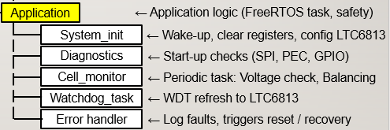
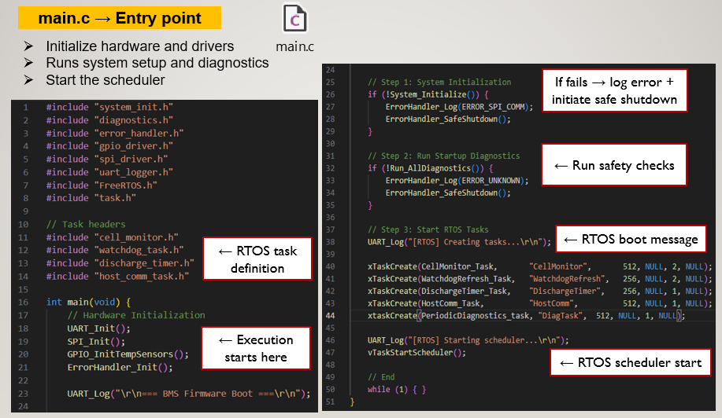
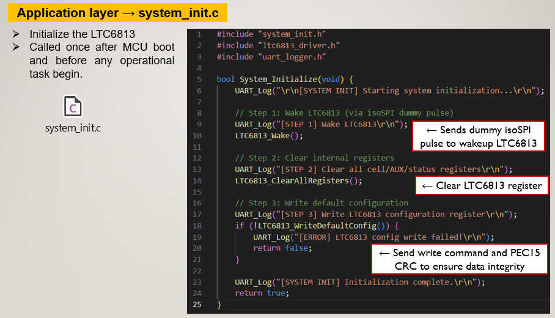
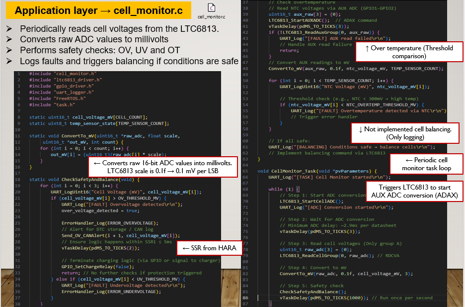
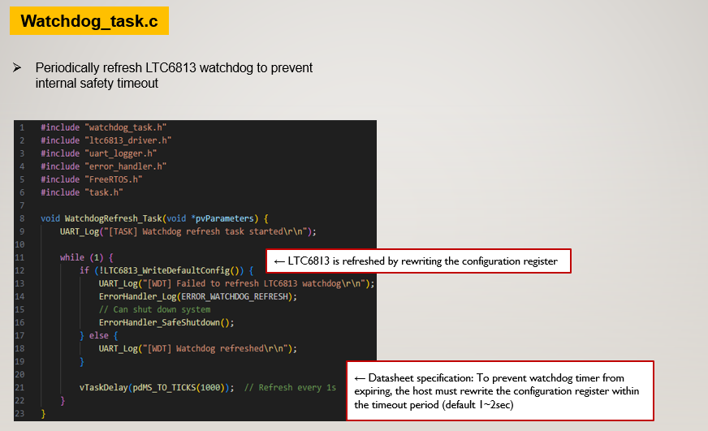
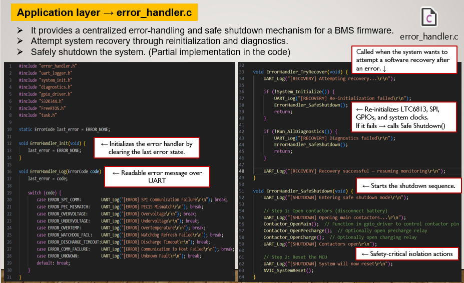

## Application_Layer
Firmware application layer contains the following main system behavior.

  

## main.c
- Program entry
- Initialize MCU/peripherals
- Create RTOS tasks
- Start scheduler

  

## System_Init.c
- Startup sequence
- Wake external device
- Clear registers
- Load default configuration
- Call startup diagnostics

  

## Sensor_Monitoring.c
- Periodic data read
- Convert raw ADC values
- Threshold checks
- Trigger control actions
- Control decisions based on measurements
※ For example threshold-based control, actuator enable/disable, balancing-like logic

  

## Watchdog_Task.c
- Periodic watchdog refresh
- Timeout handling

  

## Comm_Task.c
- Send logs / status through UART or CAN
- Package data for transmission

## Error_Handler.c
- Central error processing
- Recovery attempt
- Safe shutdown if needed

  

--END--
