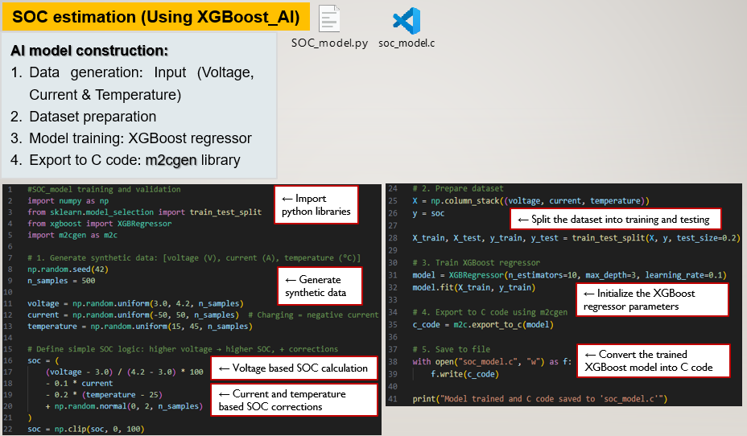

## Application_Layer
Firmware application layer contains the following main system behavior.

  

## main.c
- Program entry
- Initialize MCU/peripherals
- Create RTOS tasks
- Start scheduler

  

## System_Init.c
- Startup sequence
- Wake external device
- Clear registers
- Load default configuration
- Call startup diagnostics

  

## Sensor_Monitoring.c
- Periodic data read
- Convert raw ADC values
- Threshold checks
- Trigger control actions
- Control decisions based on measurements
※ For example threshold-based control, actuator enable/disable, balancing-like logic

  

## AI-Based SOC Estimation (XGBoost)
### Overview
This module implements State of Charge (SOC) estimation using a machine learning model based on **XGBoost regression**.
The trained model is converted into embedded C code and integrated into the application layer for real-time execution.

---

### Model Inputs
- Voltage  
- Current  
- Temperature  
---

### Key Features
- Lightweight embedded inference (no runtime ML library required)  
- Model converted to C using `m2cgen`  
- Fast execution suitable for real-time systems  
- Improved estimation accuracy compared to simple lookup methods  
---

### Workflow
1. Generate dataset (voltage, current, temperature)  
2. Train XGBoost regression model  
3. Export model to C code  
4. Integrate generated function into firmware  
5. Call model during runtime for SOC estimation  
---

### (AI SOC Implementation)

   

---

## Watchdog_Task.c
- Periodic watchdog refresh
- Timeout handling

  

## Comm_Task.c
- Send logs / status through UART or CAN
- Package data for transmission

## Error_Handler.c
- Central error processing
- Recovery attempt
- Safe shutdown if needed

  

--END--
