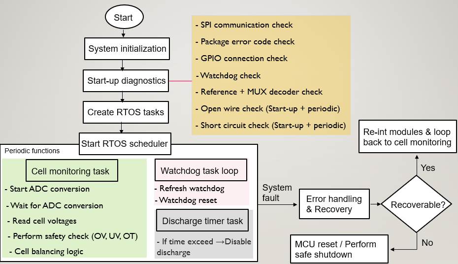
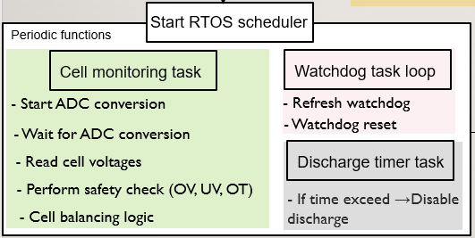
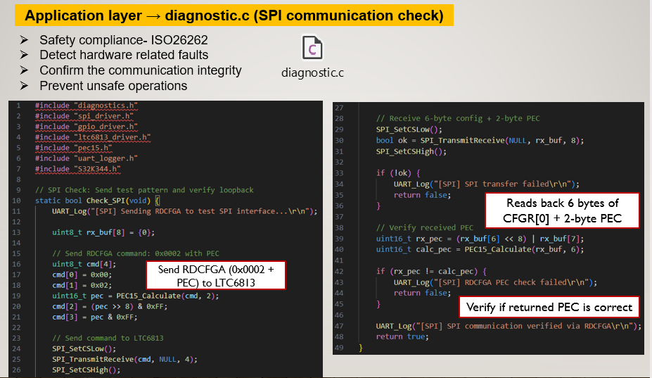
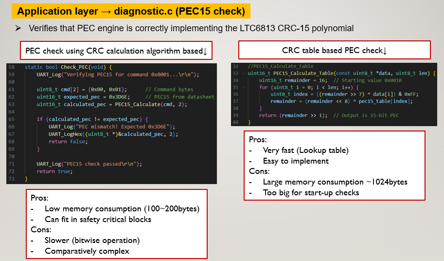
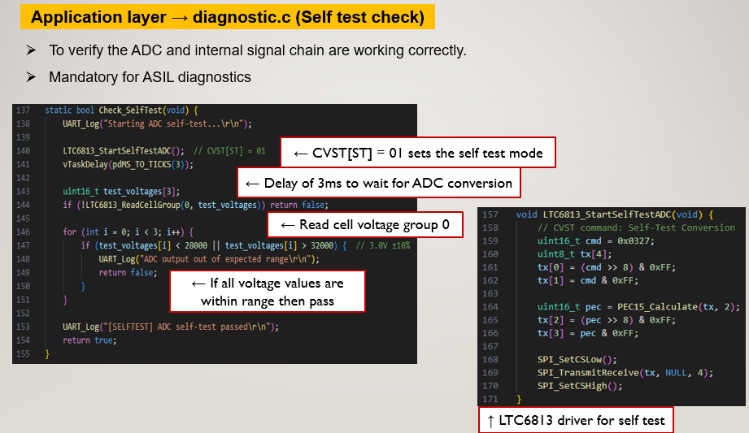
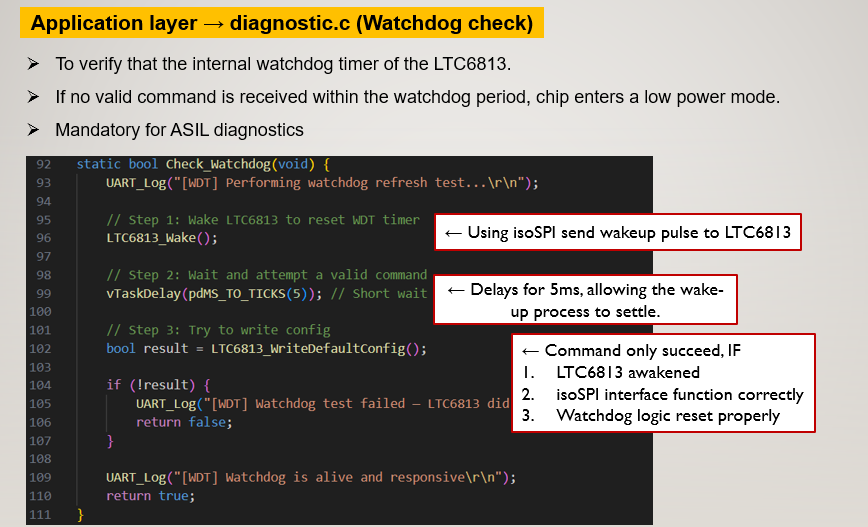
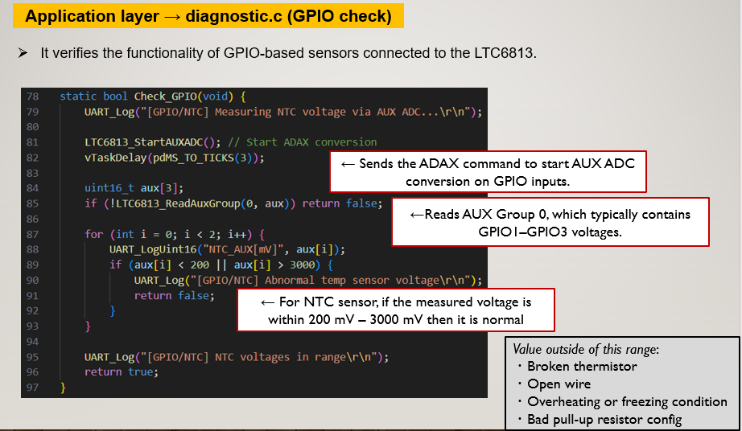
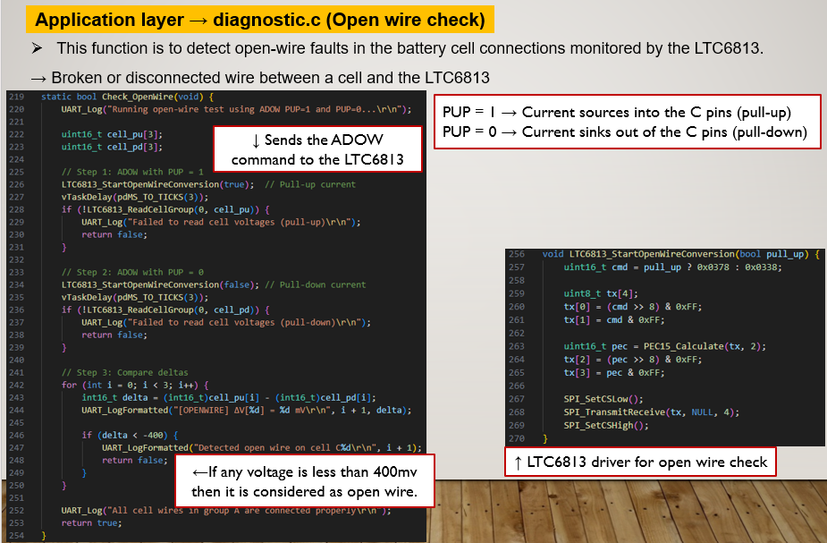
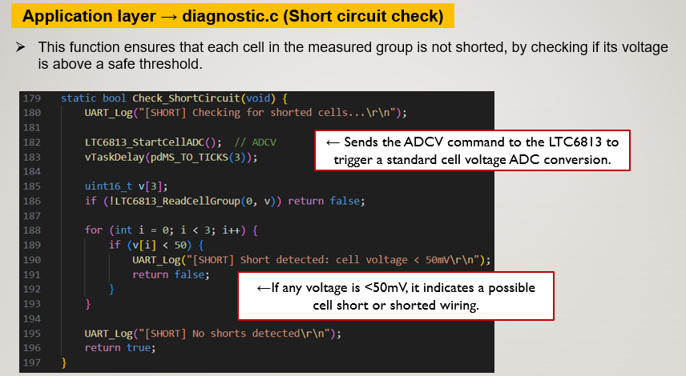
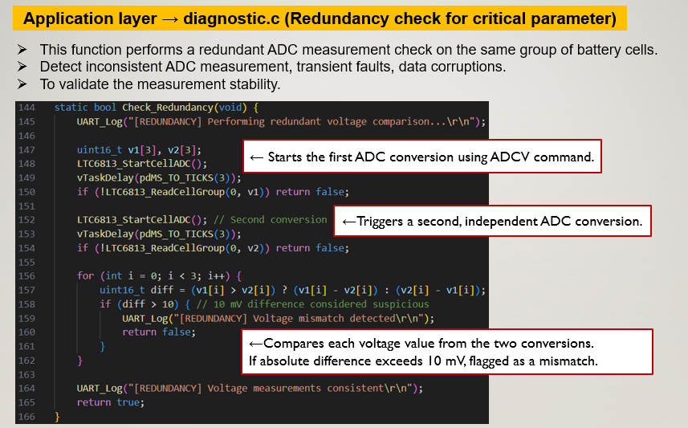

# Diagnostics Module

## Overview
This module implements the diagnostic and safety validation framework for a real-time embedded system.
It ensures system reliability by verifying communication integrity, sensor health, measurement consistency, 
and runtime safety before and during operation.

## Objectives
- Detect faults during system startup
- Monitor system health during runtime
- Validate communication integrity (CRC)
- Ensure sensor and measurement reliability
- Support safe recovery and shutdown mechanisms

## Diagnostic Coverage
The following diagnostics are implemented:
- SPI communication check  
- CRC / data integrity validation  
- ADC / internal self-test  
- Watchdog verification  
- Sensor input (GPIO/AUX) validation  
- Open-wire detection  
- Short-circuit detection  
- Redundant measurement comparison  

## Diagnostic Flow

  

The diagnostics are executed in two stages:
- Startup diagnostics → full validation before operation  
- Runtime diagnostics → periodic health monitoring  

## Module Structure
Diagnostics/
├── diagnostics.c/h
├── diag_spi.c/h
├── diag_crc.c/h
├── diag_selftest.c/h
├── diag_watchdog.c/h
├── diag_aux.c/h
├── diag_gpio.c/h
├── diag_openwire.c/h
├── diag_short.c/h
├── diag_redundancy.c/h
├── startup_diagnostics.c/h
└── runtime_diagnostics.c/h

## Startup Diagnostics
The system performs a complete validation sequence before enabling normal operation.

## Startup Sequence↓
1.SPI communication check
2.CRC validation
3.ADC self-test
4.Sensor input validation
5.Watchdog check
6.Open-wire detection
7.Short-circuit detection
8.Redundancy check

## Runtime Diagnostics
Periodic checks are executed during system operation to detect faults and degraded conditions.

Includes↓
- Watchdog monitoring
- Communication integrity checks
- Sensor plausibility checks
- Open-wire / short detection
- Measurement consistency validation
(Runtime Task)

  

**Key Diagnostic Implementations:**
**SPI Communication Check ↓**
- Verifies communication path between MCU and external device
- Confirms correct response and timing

  

**CRC / Integrity Check ↓**
- Ensures data integrity for transmitted and received frames
- Detects communication corruption

  

**Self-Test Check ↓**
- Validates internal measurement and ADC functionality
- Ensures signal chain reliability

  

**Watchdog Check ↓**
- Verifies system responsiveness
- Ensures periodic refresh mechanism is active

  

**Sensor / GPIO Check ↓**
- Validates external sensor inputs
- Detects abnormal voltage ranges

  

**Open-Wire Detection ↓**
- Detects disconnected sensor or input lines
- Based on threshold comparison

  

**Short-Circuit Detection ↓**
- Identifies abnormal low-value conditions
- Indicates possible shorted input

  

**Redundancy Check ↓**
- Compares repeated measurements
- Detects unstable or inconsistent data

  

**Design Highlights:**
Modular diagnostic structure (one file per function)
Separation of startup and runtime diagnostics
Reusable and scalable design
Supports safety-critical system behavior
Centralized fault detection and reporting

**Integration**
This module interacts with:
* Drivers Layer → SPI, GPIO, Timer
* Service Layer → Protocol handling, CRC validation
* Application Layer → System control and error handling
