# Drivers Module

## Overview
- This module provides low-level hardware interface drivers and communication foundations for a real-time embedded system.
- It abstracts hardware peripherals and enables reliable communication, diagnostics, and control.
- The design supports both prototype (blocking) and production-level (non-blocking, interrupt-driven) implementations.

---

## Objectives
- Provide hardware abstraction for peripherals
- Enable reliable communication with external devices
- Support real-time, non-blocking execution
- Ensure scalability for automotive-grade systems
---

## Supported Drivers & Interfaces

- SPI Driver (Blocking + Non-blocking)
- UART Driver
- GPIO Driver
- CAN Driver
- Timer Driver
- ISO-TP (Transport Layer)
- UDS Communication Support
---

## Driver Architecture

  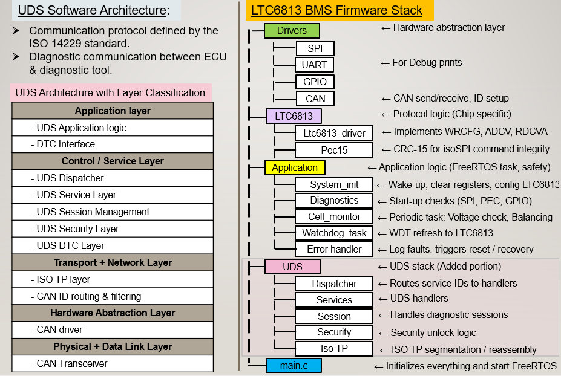 

The driver layer acts as the Hardware Abstraction Layer (HAL), interfacing between hardware peripherals and 
higher-level modules such as diagnostics, control, and communication stacks.

---

## SPI Driver
### Overview

SPI is used for communication with external devices through an isolated interface.

### Key Features

- SPI initialization and configuration  
- Manual Chip Select (CS) control using GPIO  
- Blocking communication (prototype stage)  
- Non-blocking communication (ISR-based)  
- Full-duplex data transfer  
---

### Blocking SPI
- Simple and easy to debug  
- CPU waits during transfer  
- Suitable for early prototyping  

  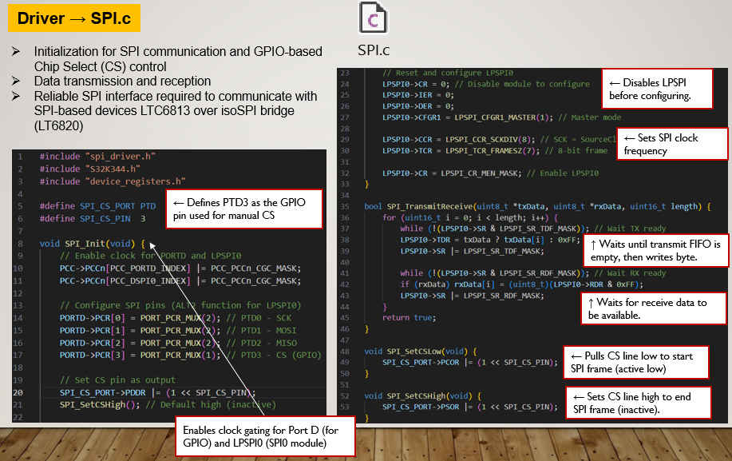 

---

### Non-Blocking SPI (Advanced)

- Interrupt-driven communication  
- CPU is free during data transfer  
- Improves system responsiveness  
- Suitable for real-time systems  

  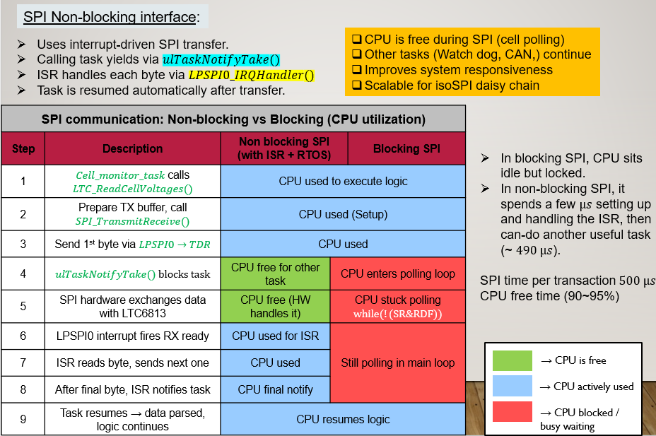 

  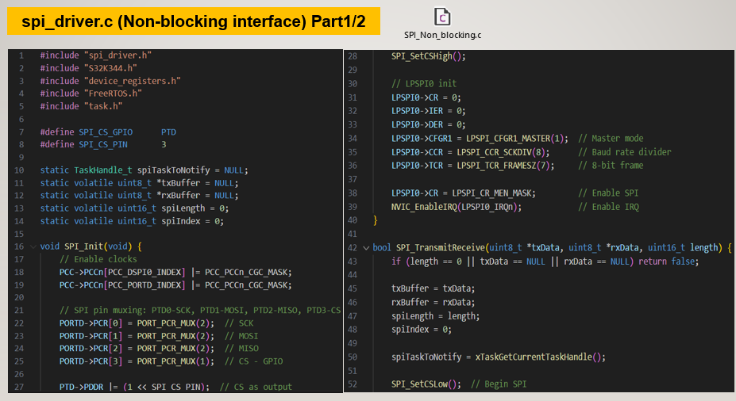 

  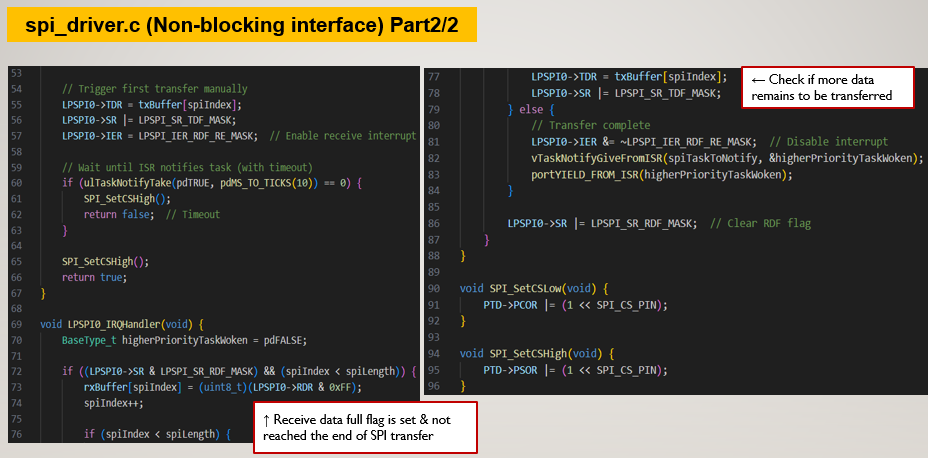 

---

## UART Driver
### Overview

UART is used for debugging, logging, and system monitoring.

### Key Features
- Serial data transmission  
- Debug logging interface  
- Lightweight implementation  

  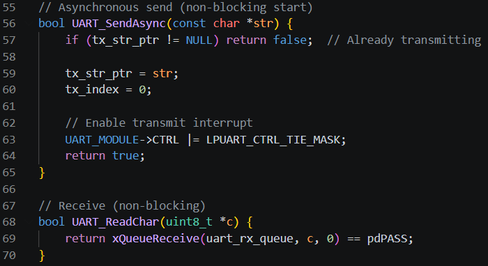 

---

## GPIO Driver
### Overview

GPIO driver handles digital input/output operations.

### Key Features
- Pin configuration and initialization  
- Digital read/write operations  
- Chip Select (CS) control  
- Sensor interface support  

  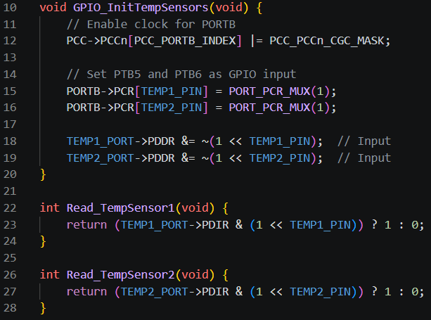 

---

## CAN Driver
### Overview

CAN driver enables communication over automotive networks.

### Key Features
- CAN initialization  
- Message transmission and reception  
- Mailbox-based architecture  
- Integration with diagnostic protocols  

  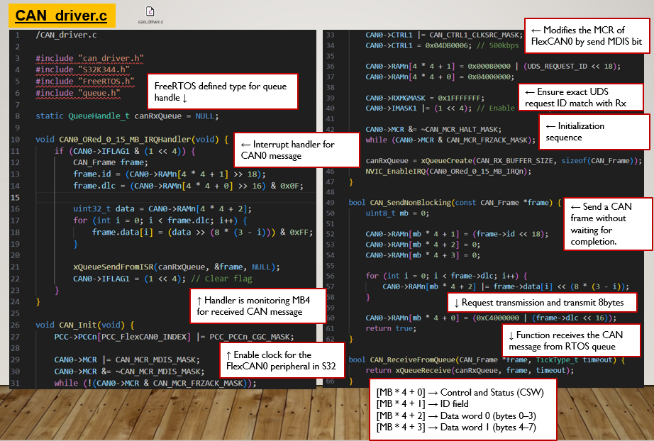 

---

## ISO-TP (Transport Layer)
### Overview

ISO-TP (ISO 15765-2) enables transmission of multi-frame messages over CAN.

### Key Features
- Single Frame / First Frame / Consecutive Frame handling  
- Flow Control mechanism  
- Message segmentation and reassembly  
- Queue-based transmission  

  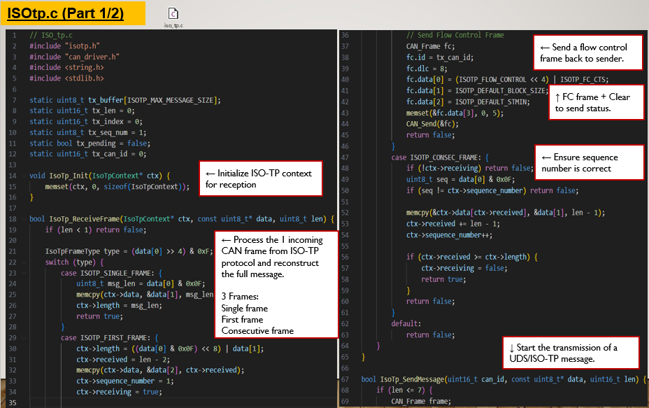 

  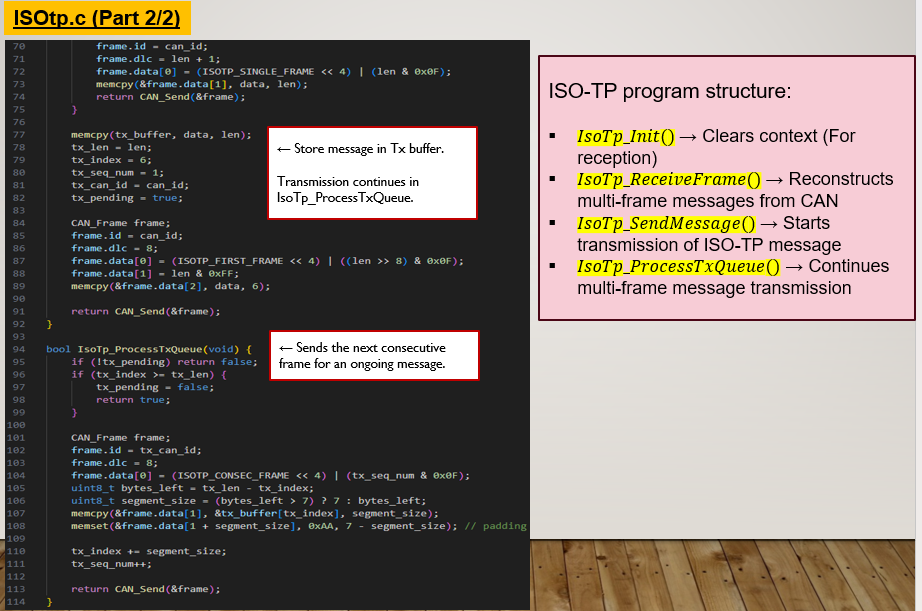 

---

## UDS Communication Support
### Overview

UDS (Unified Diagnostic Services) is used for diagnostic communication over CAN.

  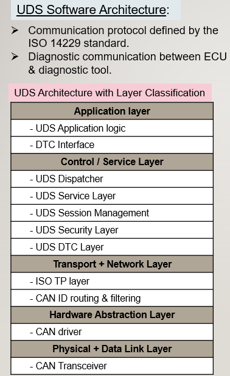 

### Key Features
- Service-based architecture (SID handling)

  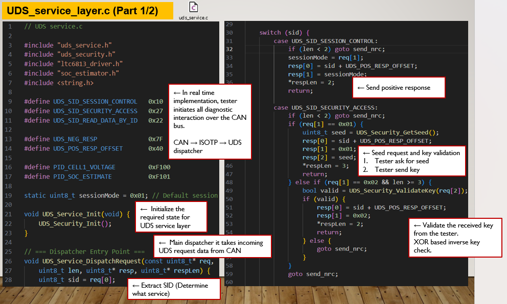 

  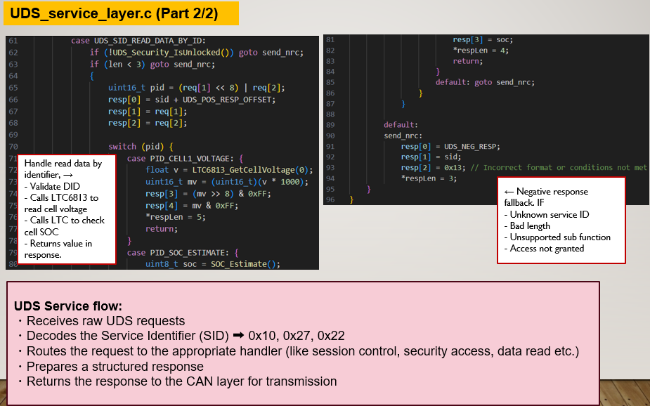 

  
- Session management

  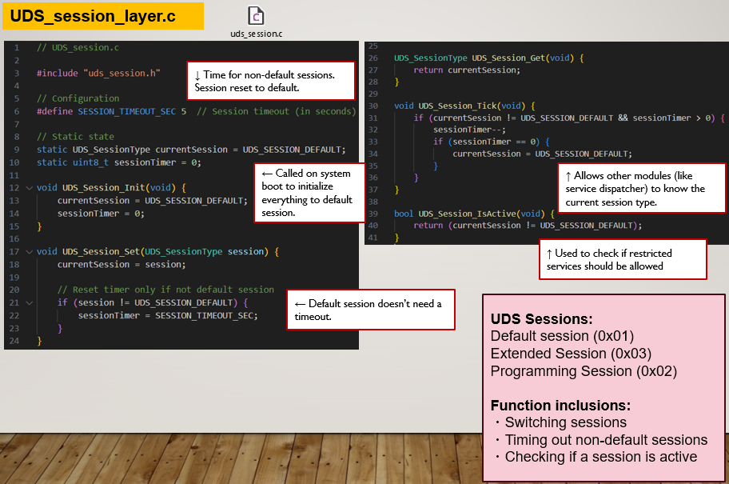 

  
- Security access (Seed & Key)

  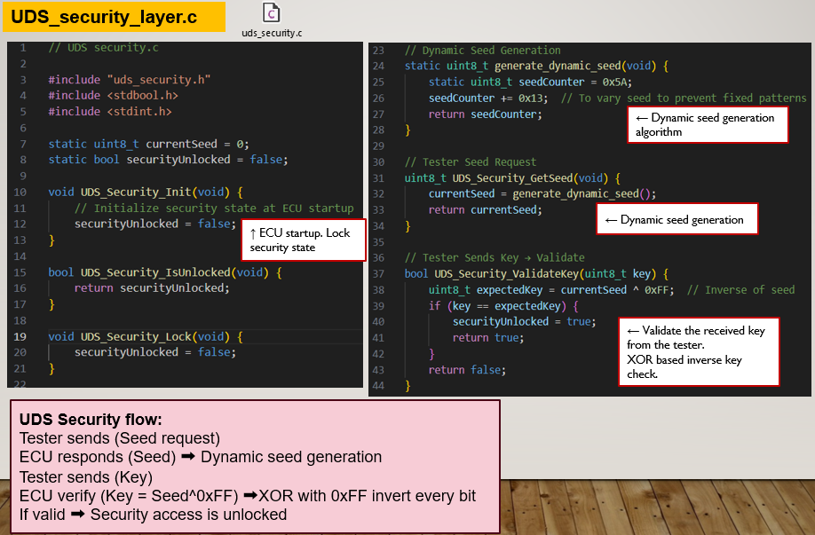 

  
- Diagnostic data read (e.g., sensor values, system state)  

  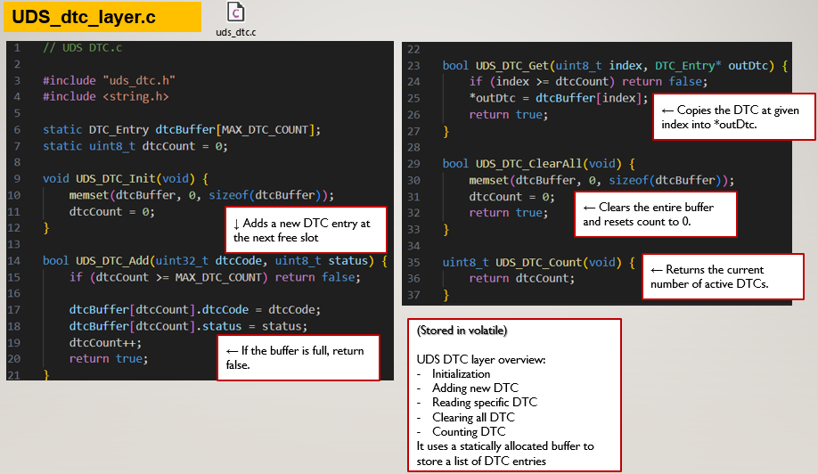 

---

## Timer Driver
### Overview

Provides timing control for real-time operations.

### Key Features
- Delay generation  
- Periodic task scheduling  
- Time-based execution control  

  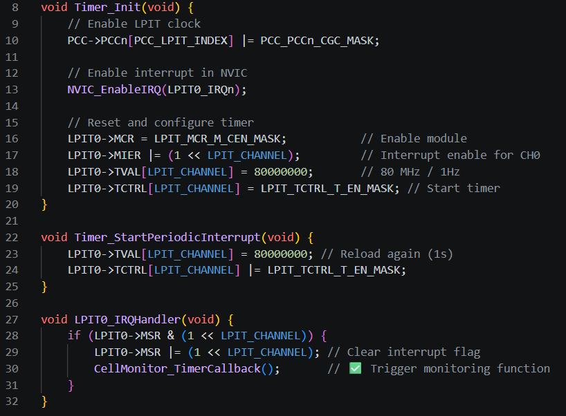 

---

## Design Highlights
- Modular and scalable driver design  
- Support for real-time execution  
- Transition from blocking to non-blocking architecture  
- Integration-ready with diagnostic and communication stacks  
- Suitable for automotive and autonomous systems  

---

## Integration
This module interfaces with:
- **Service Layer** → Protocol handling, CRC, communication stacks  
- **Application Layer** → Control logic, monitoring, diagnostics  
- **Diagnostics Module** → Hardware validation and safety checks  

---

## Notes

- Blocking SPI is used for initial validation  
- Non-blocking SPI improves CPU utilization and responsiveness  
- Drivers are designed to support AUTOSAR migration  
