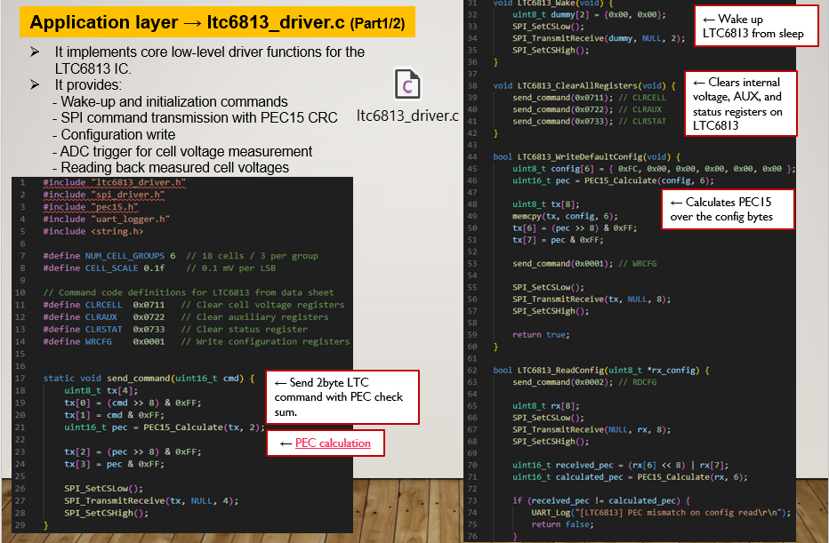
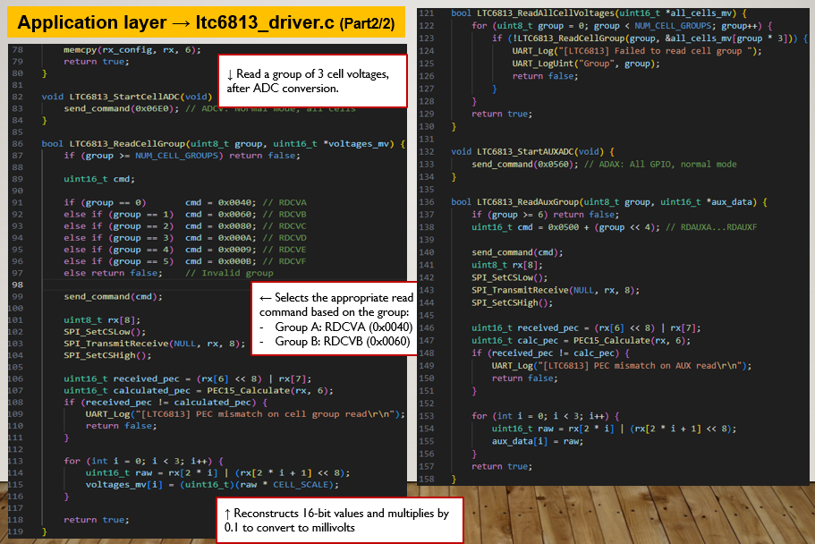
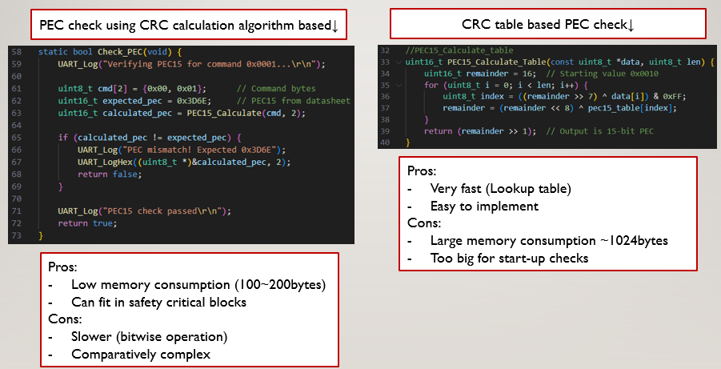
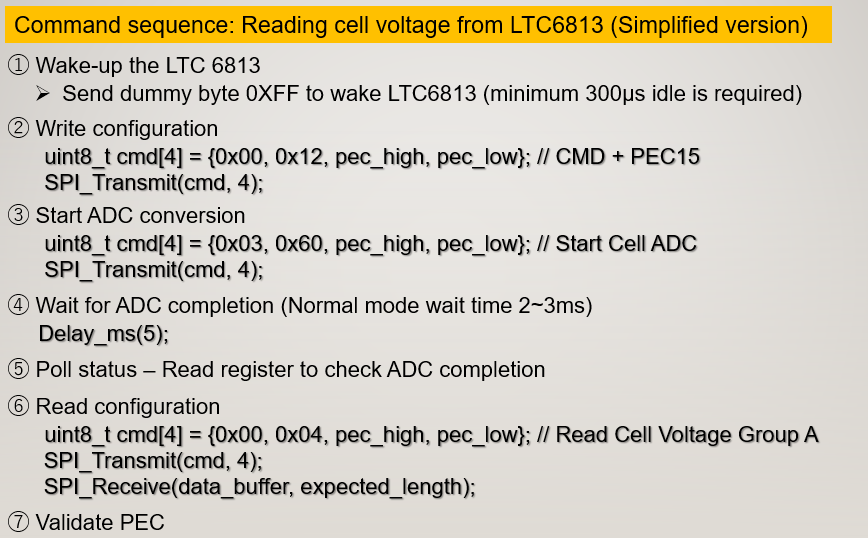

# Control / Service Layer

## Overview
- This layer implements the device-oriented control and protocol logic of the embedded system.
- It acts as an interface between the low-level drivers and the application layer, 
handling command generation, communication sequencing, CRC/PEC validation, and device-specific operations.
- The module is designed to isolate protocol complexity from application logic and provide reusable APIs for monitoring, diagnostics, and control.

---

## Objectives
- Abstract device-specific communication logic from the application layer
- Build and transmit protocol commands through the SPI driver
- Validate data integrity using PEC15 / CRC
- Provide high-level APIs for configuration, acquisition, and control
- Support scalable and maintainable embedded software architecture

---

## Layer Position

<p align="center">  </p>

This layer sits between:
- **Drivers Layer** → SPI, GPIO, UART, CAN, Timer  
- **Application Layer** → Monitoring, diagnostics, watchdog, error handling  

---

## Main Responsibilities
- Device wake-up sequence
- Register clear and configuration write
- ADC conversion trigger
- Readback of measured data
- Command encoding / decoding
- PEC15 generation and validation
- Support for diagnostics and periodic monitoring

---

## Module Structure

```text
control/
├── README.md
├── ltc6813_driver.c
├── ltc6813_driver.h
├── pec15.c
└── pec15.h
```

## LTC6813 Driver
### Overview
This module implements the device-specific command and control logic.

It provides high-level APIs to interact with the monitoring IC, including:
- Wake-up
- Configuration
- ADC control
- Readback of measurement data

---

### Key Functions
- Wake device from idle / sleep  
- Clear internal registers  
- Write configuration registers  
- Start ADC conversion  
- Read voltage measurement groups  
- Start AUX conversion  
- Execute special diagnostic commands  

---
## (LTC6813)
<p align="center">   </p>
<p align="center">   </p>

---

## PEC15 Module
### Overview
This module implements PEC15 calculation for command and response integrity checking.

It is used to detect communication corruption and ensure reliable protocol exchange.

---

### Key Functions
- Calculate PEC15 for outgoing commands  
- Validate PEC15 for incoming responses  
- Support communication diagnostics  

---

## (PEC15)

<p align="center">   </p>

---

## Communication Sequence
The control layer manages the device communication flow:
1. Wake up device  
2. Clear internal registers  
3. Write configuration  
4. Trigger ADC conversion  
5. Wait for conversion completion  
6. Read measured data  
7. Validate PEC15  
8. Return processed data to the application layer  

---

<p align="center">   </p>

---

## Integration with Other Layers
### Uses from Drivers Layer
- SPI transmit / receive  
- GPIO control for Chip Select  
- Timer / delay support  
- UART logging (optional)  

---

### Used by Application Layer
- System initialization  
- Startup diagnostics  
- Runtime monitoring  
- Watchdog refresh  
- Control actions  

---

## Design Highlights
- Clear separation between hardware access and application logic  
- Centralized protocol handling  
- Reusable device command APIs  
- Communication integrity using PEC15  
- Suitable for safety-critical embedded systems  

---

## Notes
- Current implementation supports command-based communication over SPI through an isolated interface  
- The control layer isolates application logic from device-specific command handling  
- The design supports migration toward AUTOSAR-style layered architecture  
