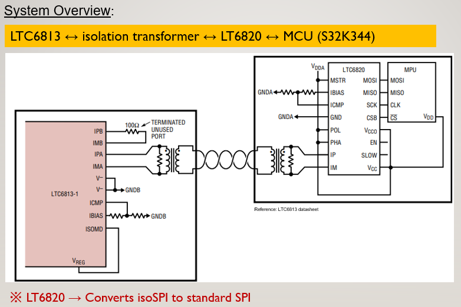
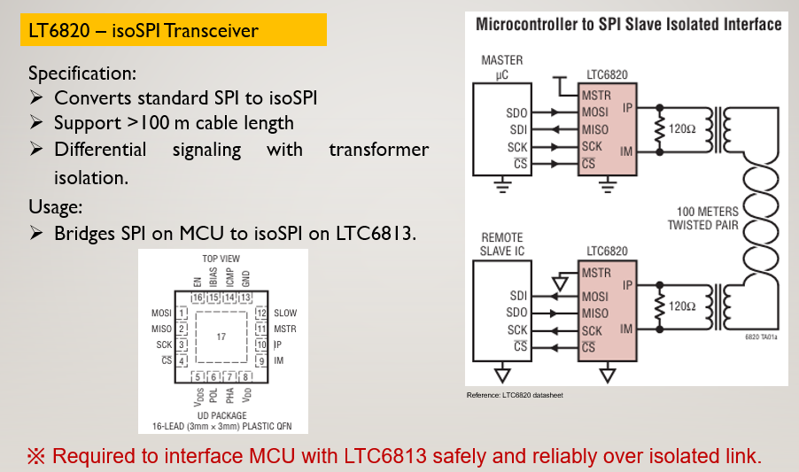
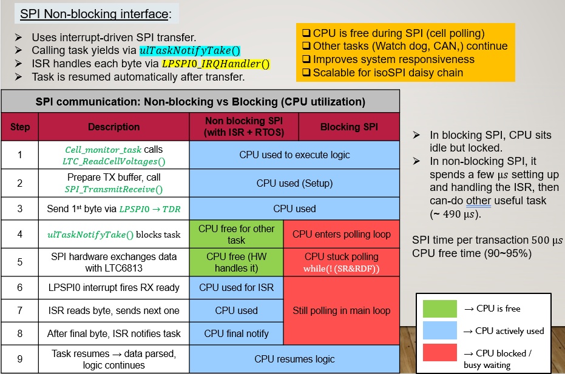
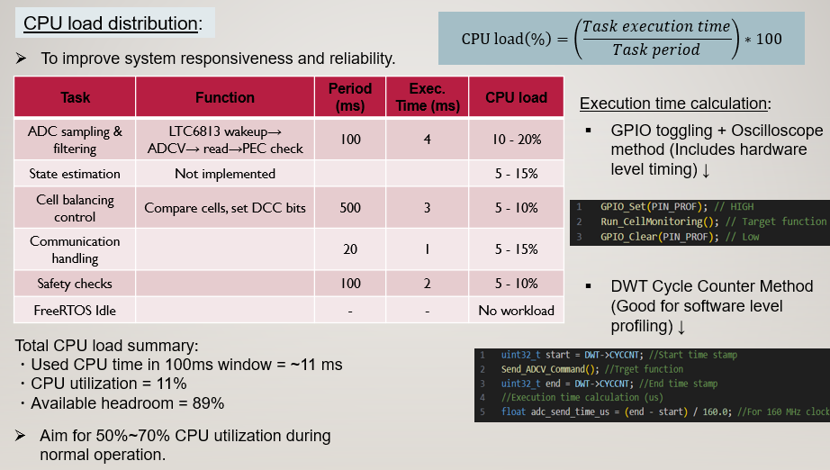
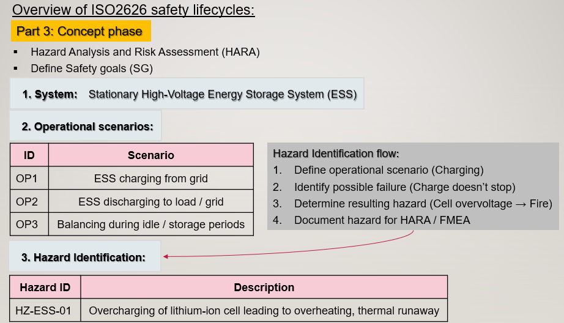
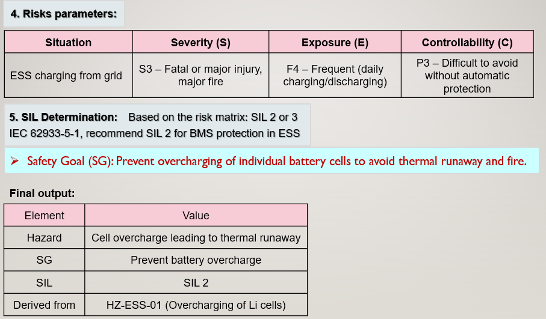
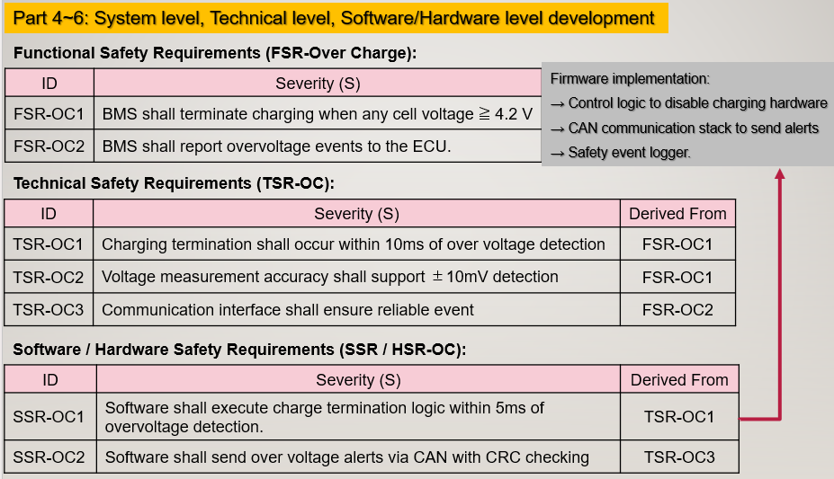

# Safety-Critical Embedded System with AI-Based State Estimation
## Overview
RTOS-based firmware implementation with:
- Real-time monitoring
- Diagnostics and safety checks
- SPI/CAN communication
- AI-based SOC estimation (XGBoost)
- EKF-based state estimation

## Objective
- The objective of this project is to develop a complete firmware to enable communication between the LTC6813 battery cell monitoring IC 
and the NXP S32K344 microcontroller (MCU) using the isoSPI protocol.

- The system performs real-time data acquisition, diagnostics, and control in a deterministic manner, following a modular layered architecture:
**Application → Services → HAL**

- It integrates robust communication, fault detection, and safety mechanisms aligned with automotive principles.

- This project demonstrates the integration of **AI-based and model-based estimation techniques**,
making it suitable for advanced automotive and autonomous system applications.

  

- The system is designed to be scalable and suitable for automotive applications, with considerations for ISO26262 safety compliance, 
modularity, and deterministic execution.

  

---

**Key functions**:
- Real-time acquisition of sensor data using ADC-based measurement
- Execution of safety-critical checks including threshold monitoring and fault detection
- Communication with external devices using SPI over an isolated interface
- Data integrity validation using CRC-based error detection (PEC15)
- Implementation of watchdog mechanisms to ensure system reliability
- Execution of startup and runtime diagnostics to detect latent faults

## RTOS Task Design
  

  

- Monitoring Task → Sensor acquisition + safety checks  
- Diagnostics Task → Startup & runtime validation  
- Watchdog Task → System health supervision  
- Communication Task → Logging / data exchange

## Communication Design

  

- Command + CRC-based communication
- Data integrity validation using CRC
- Reliable communication over isolated interface

  

## Safety Features
- Startup diagnostics before system operation  
- Runtime fault detection  
- Watchdog-based recovery  
- Open/short detection logic  
- Centralized error handling  
- Safe shutdown mechanism  

## Performance & Optimization
- Low CPU utilization with high headroom  
- Support for non-blocking communication (ISR-based)  
- Optimized task scheduling and prioritization  
- Efficient memory usage strategy  

  

## AI-Based State Estimation (SOC)
This project includes an AI-based state estimation module implemented using **XGBoost regression**, 
demonstrating the integration of machine learning with embedded systems.

### Key Points
- Model trained using voltage, current, and temperature data  
- Converted to embedded C code using `m2cgen`  
- Runs directly on MCU without external ML libraries  
- Designed for real-time execution  

   

## ISO26262 implementation
→ Performing Hazard Analysis and Risk Assessment (HARA) ↓

  

→ Defining Safety Goals ↓

  

→ Fuctional Safety Requirements ↓
→ Technical Safety Requirements ↓
→ Software & Hardware Safety Requirements

  

## Presentation

📄 [View Full Technical Presentation](docs/Technical_Presentation.pdf)

## Project Structure
- **app/** → Application layer (RTOS tasks, control logic, AI estimation)  
- **services/** → Control layer (protocol, device driver, PEC15)  
- **drivers/** → Hardware abstraction (SPI, UART, GPIO, CAN, Timer)  
- **diagnostics/** → Safety and fault detection  
- **configs/** → System configuration and thresholds  
- **tests/** → Validation and test programs  
- **docs/** → Documentation and diagrams  

## Future Improvements
- Sensor fusion integration  
- State estimation (Kalman Filter)  
- Advanced control algorithms  
- ROS / autonomous system integration
